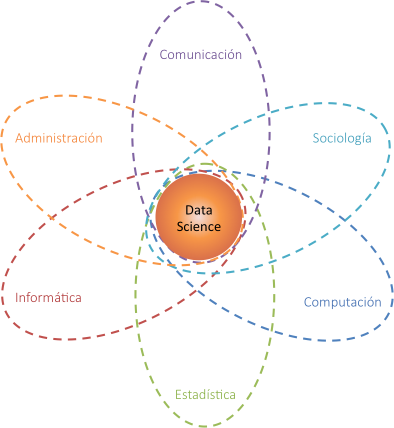
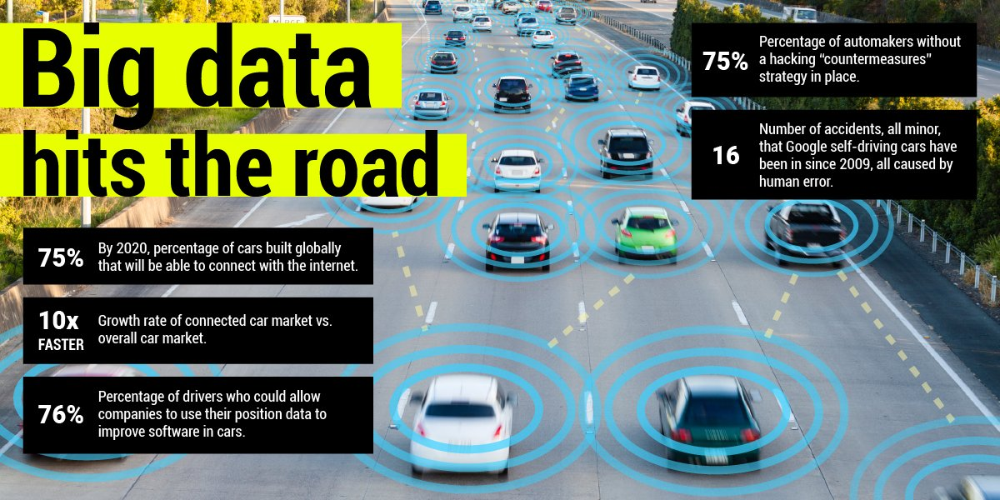
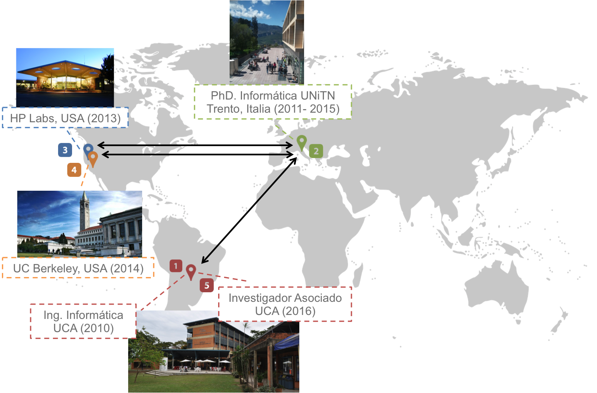

## ¿Qué es la ciencia de los datos?

_Campo interdisciplinario que se basa y sintetiza una serie de disciplinas y áreas del conocimiento, incluyendo **estadística**, **informática**, **computación**, **comunicación**, **administración**, y **sociología**, con el objetivo descubrir conocimento a partir de los datos_

[Data Science: Challenges and Directions](https://cacm.acm.org/magazines/2017/8/219605-data-science/fulltext)

--- &twocol 

## Motivación

*** =left

Nunca antes tuvimos acceso a tantos datos (big data)

[The Data Deluge](http://www.economist.com/node/15579717)

*** =right

El big data es el motor de la innovación actual (self-driving cars, real-time object classifiers, voice assistants, chatbots)

[Big Data Hits the Road](http://www.businessinsider.com/connected-cars-2015-9)

---

## Motivación

La demanda de científicos de datos ha crecido **exponencialmente** desde el 2011

[Data Scientist: The Number One Job In America](http://blog.edx.org/the-importance-of-data-science-in-the-21st-century)

---

## Datos (el nuevo petróleo)

[The world’s most valuable resource is no longer oil, but data](https://www.economist.com/news/leaders/21721656-data-economy-demands-new-approach-antitrust-rules-worlds-most-valuable-resource)

--- 

## Datos

<q>Los datos son valores pertenecientes a un <redtext>conjuntos de items</redtext> y representados a través de <greentext>variables</greentext> <bluetext>cualitativas o cuantitativas</bluetext>.</q>

<redtext>Conjunto de items</redtext>: Conjunto de objetos de interés, a veces llamado población

<greentext>Variables</greentext>: Medida o característica de un item

<bluetext>Cualitativo</bluetext>: Pais de origen, sexo, religión, <bluetext>Cuantitativo</bluetext>: Altura, peso, edad

[Data (Wikipedia)](http://en.wikipedia.org/wiki/Data)

---

## Big data (las 4 Vs)

_Datos con alto volumen, alta velocidad, alta variedad, y alta veracidad_ [(Foster et al., Big Data and Social Science)](https://www.amazon.com/Big-Data-Social-Science-Statistics/dp/1498751407/ref=sr_1_1?ie=UTF8&qid=1506629819&sr=8-1&keywords=big+data+and+social+science)

---

## Sobre mi

---

## Organización del curso

1. Introducción a la ciencia de los datos y base teórica
2. Herramientas para análistas y científicos de datos
3. Colección y pre-procesamiento de datos
4. Análisis Exploratorio de datos
5. Inferencia Estadística
6. Aprendizaje supervisado

---

## Proyecto (BECAL)

BECAL es el programa nacional de becas de postgrados en el exterior del gobierno nacional. Hasta el momento el gobierno nacional lleva invertido en el mismo casi **120.000.000 millones de guaranies** en la financiación de cerca de **900 becarios**, sin embargo, poco se conoce del perfil de los beneficiarios (edad, sexo, nivel socio-económico, profesión, sector laboral, etc). Además, se sabe poco de las capacidades que estos beneficiarions adquieren en sus estudios y que ayudarán a potenciar la fuerza laboral local. Entonces, <redtext>_**hasta el momento es difícil cuantificar cual es el beneficio real del programa para el país**_</redtext>.

En este proyecto utilizarremos técnicas de ciencia de los datos para conocer más en detalle la política de becas del gobierno nacional.

[Informe BECAL - Marzo 2017](http://www.becal.gov.py/informe-becal-actualizacion/)

---

## Evaluación

Para la obtención de los 2 créditos académicos es necesario cumplir con los siguientes requisitos.

- Asistencia a 80% de la clases

- Alcanzar el 70% del puntaje total de las tareas dentro del proyecto BECAL:

  * Base conceptual: 5 pts.
  * Git: 5 pts.
  * Preprocesamiento: 20 pts.
  * EDA: 30 pts.
  * Inferencia: 25 pts.
  * Aprendizaje: 15 pts.

- Con la continuidad del proyecto posterior a la culminación del curso se podrán otorgar créditos adicionales si el resultado alcanzado deriva en una publicación científica.

[Sitio del Curso](https://github.com/joausaga/datascience-course)