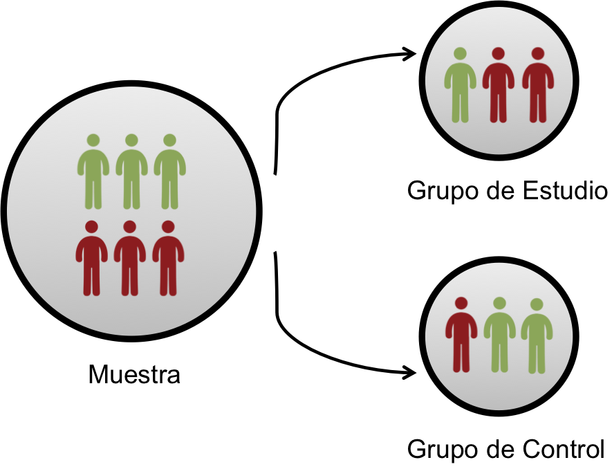

## Tipo de datos y medidas

En data science los tipo de datos tradicionales son:

- **Continuo**: datos que pueden tomar cualquier valor en un intervalo determinado. Ej., Salario=10500.507$

- **Discreto**: datos que pueden tomar solo valores enteros, como ser contadores. Ej., Edad=25

- **Categorico**: datos que pueden tomar valores determinados en un conjunto finito de elementos o categorías. Ej., Sexo=Femenino, donde _Sexo_ puede tomar valores solo los valores Masculino o Femenino

- **Binario**: tipo especial de dato categórico que puede tomar solo dos valores, verdadero/falso, 0/1, si/no. Ej., Llueve=Si

- **Ordinal**: tipo especial de dato categórico donde los valores tienen poseen un orden específico. Ej., PuntajeExamen=4 donde _PuntajeExamen_ puede tomar los valores 1, 2, 3, 4, o 5.

---

## Estructura y representación de los datos

En data science los datos se estructuran comúnmente de manera tabular en filas y columnas 

---

## Tipos de análisis en proyectos de Data Science

**En orden (aproximado) de dificultad**

* Descriptivo
* Exploratorio
* Inferencial
* Predictivo
* Causal

---

## Análisis descriptivo

**Objetivo**: Describir el conjunto de datos de interés

* Normalmente es el primer tipo de análisis de datos realizado
* No es lo mismo la descripción de los datos que la interpretación de los mismos
* Las descripciones no se pueden generalizar sin modelos estadísticos adicionales
* Generalmente se estudian las variables de interés por separado

---

## Caso de Uso: Censo

Un caso común de uso es la presentación de resultados de censos

[Resultados Finales Censo 2012, Dirección General de Estadísticas, Encuestas, y Censos](http://www.dgeec.gov.py/v1/Publicaciones/Biblioteca/indicadores/Triptico.pdf)

---

## Análisis exploratorio

**Objetivo**: Encontrar en los datos relaciones, conexiones, o patrones desconocidos

* Por si solos no deben utilizarse para generalizaciones/predicciones
* El resultado de los análisis exploratorios no son generalmente conclusivos
* Son útiles para definir futuros estudios
* Generalmente se combinan las variables para su estudio

---

## Caso de Uso: Edad y rendimiento deportivo

[The Clock Is Ticking](https://www.economist.com/blogs/gametheory/2014/07/player-age-football)

---

## Correlación no implica causalidad

[There's A Shocking Connection Between Eating More Chocolate And Winning The Nobel Prize](http://www.businessinsider.com/chocolate-consumption-vs-nobel-prizes-2014-4)

Otros ejemplos: [Spurious Correlations](http://tylervigen.com/spurious-correlations)

---

## Análisis Inferencial

**Objetivo**: Inferir conocimiento sobre una población a partir de una muestra de la misma

* Generalmente es el objetivo de los modelos probabilísticos
* La inferencia implica estimar tanto la cantidad como la incertidumbre de estimación
* Depende fuertemente tanto de la población como de la muestra

---

## Caso de Uso: Efecto del control de la polución ambiental en la expectativa de vida

[Correia et al. (2013) Epidemiology](http://journals.lww.com/epidem/Fulltext/2013/01000/Effect_of_Air_Pollution_Control_on_Life_Expectancy.4.aspx)

---

## Muestreo Aleatorio

* Un elemento clave en el análisis inferencial es el muestreo
* La muestra debe ser siempre un representación aleatoria de la población
* Fallas en el muestro introducen errores en el estudio
* **Encuesta Presidencial (1936)**: Literary Digest 10M (Al Landon) vs. Gallup Poll 2K (Roosevelt)

[Why the 1936 Literary Digest Poll Failed](https://www.jstor.org/stable/2749114?seq=1#page_scan_tab_contents)

---

## Análisis Predictivo

**Objetivo**: Utilizar datos conocidos para predecir valores desconocidos

* Si $X$ predice $Y$, eso no significa que exista una relación causal entre $X$ e $Y$
* Lo que hace la diferencia en las predicciones no es tanto la complejidad del modelo sino la cantidad de datos
* Precidir eventos futuros no es trivial

---

## Caso de Uso: Predecir embarazo a través de compras

[How Target Figured Out A Teen Girl Was Pregnant Before Her Father Did](http://www.forbes.com/sites/kashmirhill/2012/02/16/how-target-figured-out-a-teen-girl-was-pregnant-before-her-father-did/)

---

## Análisis Causal

**Objetivo**: Investigar que ocurren con el comportamiento de una variable al modificar otras variables.

* Una condición fundamental para identificar causalidad es la **asignación aleatoria**
* El control de la mayor cantidad posible de factores es también importante para inferir causalidad
* Las relaciones causales generalmente se identifican como efectos promedio, no se aplican a cada individuo

---

## Caso de Uso: Discriminación Laboral

[Influence of sex role stereotypes on personnel decisions](http://fcrstemalgebra1.pbworks.com/w/file/fetch/82019231/1e.%20Sex%20role%20stereotypes.pdf)

---

## Experimentos vs. Estudios Observacionales

* Las principales diferencias: como se toman las muestras y como se hacen las asignaciones

---

## Experimentos vs. Estudios Observacionales

* Las principales diferencias: como se toman las muestras y como se hacen las asignaciones

---

## Proceso de Data Science

 

 

1. Establece pregunta de investigación
2. Obtención y pre-procesamiento (limpieza, normalización) de datos
3. Exploratorio de los datos
4. Sacar conlusiones
5. Comunicación

---

## Establecer pregunta de investigación

¿Ayudaría un cambio en el diseño del sitio a mejorar las donaciones? 

[How Obama Raised $60 Million by Running a Simple Experiment](https://blog.optimizely.com/2010/11/29/how-obama-raised-60-million-by-running-a-simple-experiment/)

---

## Obtención y pre-procesamiento de datos

**Normalmente esta etapa incluye los siguientes pasos:**

* Generar datos por medio de estudios o experimentos, o extraer datos de fuentes existentes (open-data por ejemplo)
* Limpiar los datos, descartando registros inválidos, eliminando duplicados, normalizando valores de variables
* Ajustar el formato de los datos a los requeridos para el análisis

Es la etapa que normalmente lleva más tiempo y trabajo

---

## Exploración

En esta etapa se realiza un análisis exploratorio de los datos con la internción de identificar patrones o encontrar relaciones entre los datos

---

## Conclusiones

**Una vez familiarizados con los datos, usualmente:**

* Se sacan conclusiones sobre los datos por medio análisis inferenciales o causales (por ejemplo, Facebook podría concluir que posts son más atractivos para sus usuarios)
* Se realizan estimaciones sobre información desconocida por medio de análisis predictivos (por ejemplo, Netflix podría predicir que películas sugerir a sus usuarios)

---

## Comunicación

Los resultados son útiles únicamente en cuanto estos son comunicados. Existen varias maneras de comunicar los resultados de un proceso de data science:

* Blog posts
* Paper (artículo científico)
* Presentación de Powerpoint
* Email

---

## Proceso no lineal

 

 

Interacción entre las etapas de exploración y pre-procesamiento de datos porque es difícil a-priori resolver todos los problemas con los datos antes de explorarlos

---

## Proceso no lineal

 

 

A lo largo del proceso es muy común volver a revisar la pregunta de investigación y refinarla, adaptandola a los datos con que se cuentan

---

## Proceso no lineal

 

 

* Muchas veces la obtención de los datos se realiza antes de establecer la pregunta de investigación (como en nuestro caso), adaptando la misma a los datos con que se cuenta
