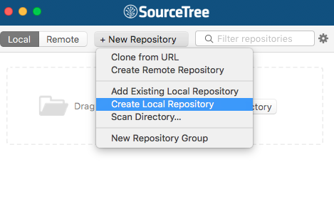
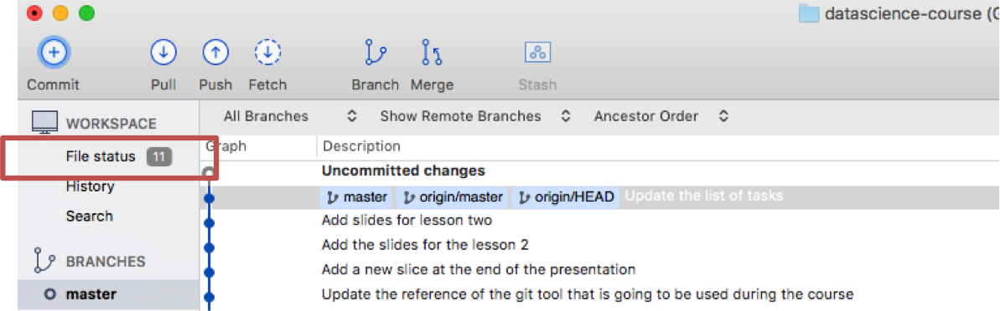
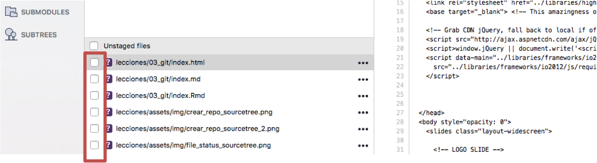
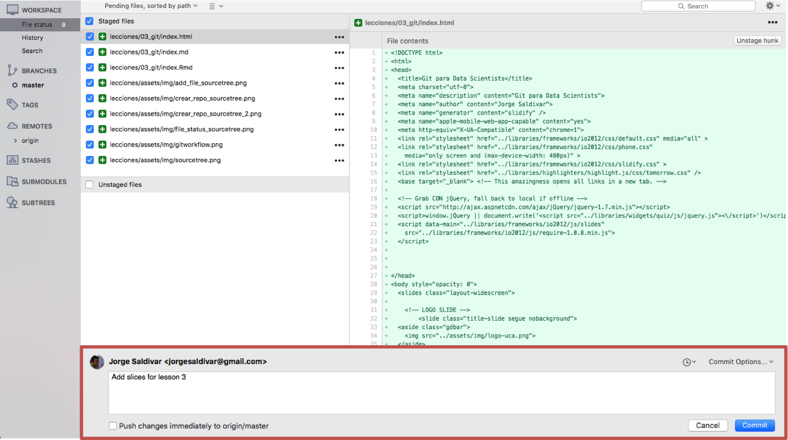
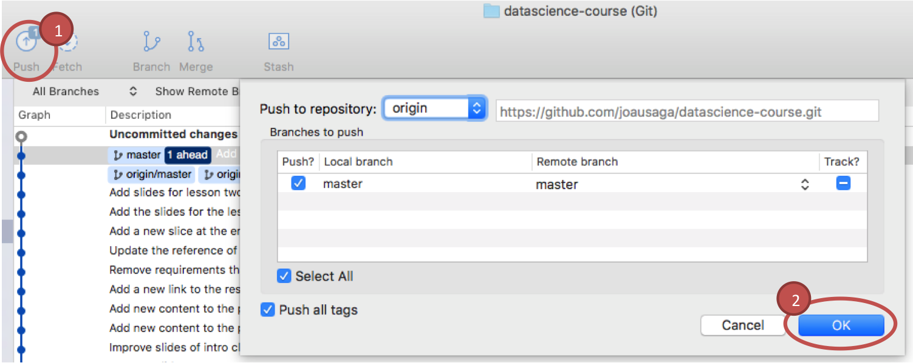
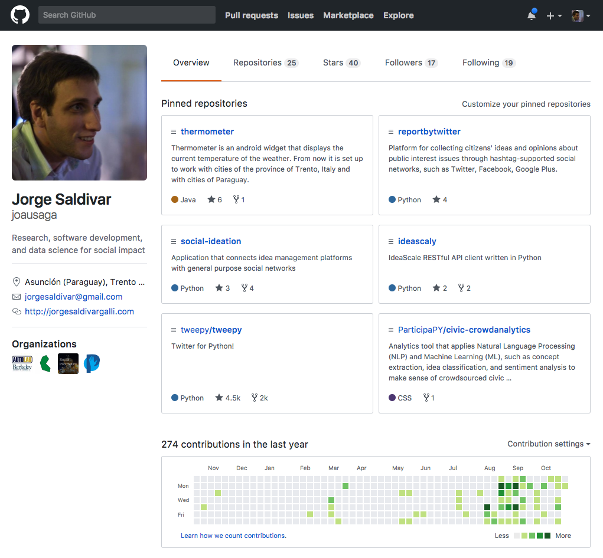
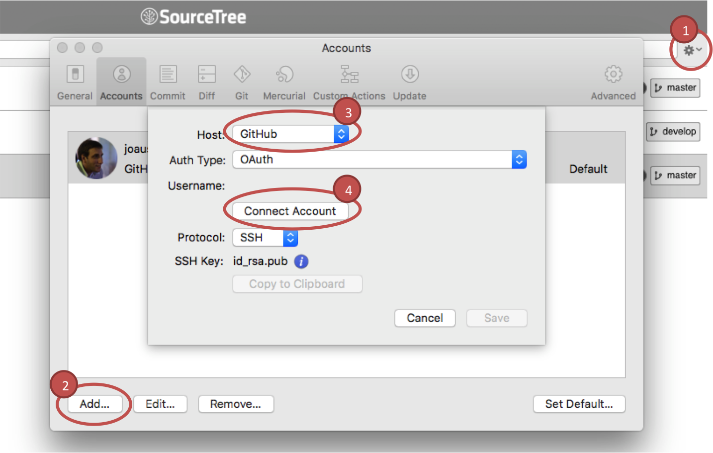
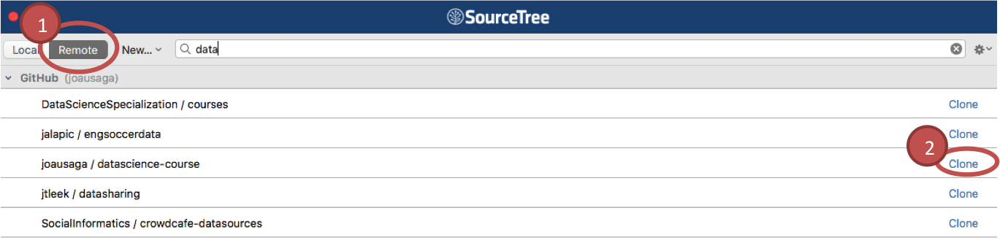
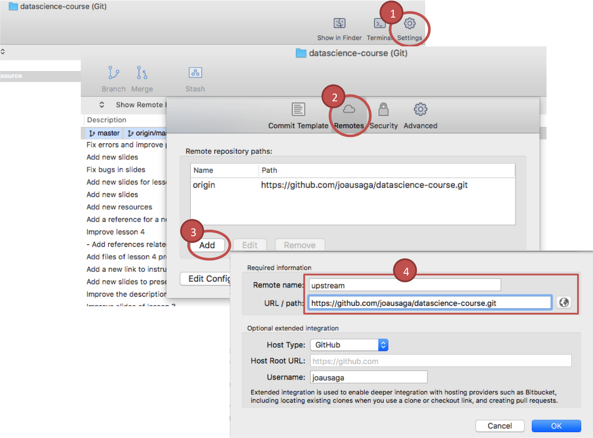
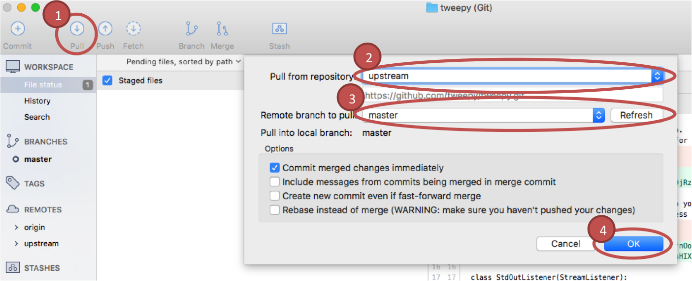

## ¿Qué es un sistema de control de versiones?

<br>

* Muchos de nosotros constantemente creamos algo, lo guardamos, lo cambiamos y luego lo guardamos de nuevo
* **El sistema de control de versiones es un medio para gestionar este proceso de manera eficiente**
* Es particularmente importante en trabajos colaborativos, como el desarrollo de software

<br>

[http://en.wikipedia.org/wiki/Revision_control](http://en.wikipedia.org/wiki/Revision_control)

---

## ¿Qué es Git?

<br>

**Git es un sistema de control de versiones distribuido, de código abierto, y gratuito diseñado para manejar desde proyectos pequeños a muy grandes, con velocidad y eficiencia.**

<br>

* Creado por las mismas personas que desarrollaron Linux
* Es hoy en día, la implementación más utilizada del control de versiones
* En Git todo está almacenado en repositorios locales


[http://git-scm.com/](http://git-scm.com/)

[http://git-scm.com/book/en/Getting-Started-A-Short-History-of-Git](http://git-scm.com/book/en/Getting-Started-A-Short-History-of-Git)

---

## SourceTree, cliente local Git

SourceTree es un cliente Git que nos ayudará a gestionar nuestro repositorios locales por medio de una simple y amigable interfaz gráfica.


[SourceTree](https://www.sourcetreeapp.com)

---

## Git workflow


[Git Tutorial – Commands And Operations In Git](https://www.edureka.co/blog/git-tutorial)

---

## Git, 5 operaciones básicas con SourceTree

* Crear repositorio local

* Agregar archivos (stage)

* Registrar cambios (commit)

* Enviar cambios (push)

* Recibir cambios (pull)

---

## Crear repositorio local

* Clic en **+ New Repository**, luego clic en **Create Local Repository**



* Ingrese la ruta de destino y el nombre del depósito, luego clic en Crear.


[Create a local repository](https://confluence.atlassian.com/get-started-with-sourcetree/create-a-local-repository-847359103.html)

---

## Agregar archivos (staging)

* Clic en **File Status** en la margen derecha superior de la interfaz



* Clic en el checkbox de los archivos que se desean agregar



---

## Registrar cambios (commiting)

Luego de agregar los archivos, agregar un mensaje en el textbox de la parte inferior de la pantalla y hacer clic en el botón **Commit**



---

## Enviar cambios (pushing)

Hacer clic en el botón **Push** del menú superior y luego clic en el botón **OK**



---

## Github, servicio web Git

<q>GitHub es un servicio web para alojar proyectos de desarrollo de software que utiliza el sistema de control de revisiones Git.</q>

[http://en.wikipedia.org/wiki/GitHub](http://en.wikipedia.org/wiki/GitHub)

--- &twocol

## Github, servicio web Git

*** =left

* Permite a los usuarios hacer push (y pull) de sus repositorios locales hacia (y desde) repositorios remotos en la web, respaldandolos en el servidor de GitHub en caso de que algo ocurra con las copias locales
* Proporciona a los usuarios una página de inicio que muestra sus repositorios públicos
* Aspectos sociales de la plataforma permiten compartir proyectos entre usuarios

[Github](https://github.com)

*** =right



---

## Fork

Crear una copia de algún repositorio existen a nuestra cuenta Github


--- &twocol

## Conectar SourceTree a Github

*** =left

1. Clic en "rueda" de configuración en la margen superior derecha de la interfaz y luego clic en **Account**

2. Clic en el botón **Add** de la ventana emergente

3. Elegir la opción Github de la lista de **Hosts**

4. Clic en el botón **Connect Account** e introducir las credenciales del usuario Github a conectar

*** =right



---

## Clonar repositorio remoto

1. Clic en la opción **Remote** en la marge izquierda del menú principal

2. Elegir de la lista el repositorio a clonar y clic en **Clone**

Al finalizar el proceso de clonación el repositorio recién clonado debería aparecer listado al hacer clic sobre la opción **Local** ubicada a la izquiera de la opción Remote en el menú principal



---

## Sincronizar cambios (pull)

Para sincronizar el reporitorio local con los últimos cambios en el repositorio original debemos primero agregar este repositorio, normalmente llamado **upstream**, a nuestro repositorio local



---

## Sincronizar cambios (pull)

Luego de agregar el repositorio upstream, seguir los siguientes pasos:

1. Clic en el botón **Pull** del menú superior

2. Elegir la opción **upstream** en la lista **Pull from repository**

3. Elegir la opción **master** en la lista **Remote branch to pull**

4. Clic en el botón **OK**



---

## Lenguaje Markdown

<q>Markdown es un lenguaje de marcas ligero compuesto por un conjunto de sintaxis que permiten dar formato al texto.</q>

[Markdown](https://es.wikipedia.org/wiki/Markdown)

---

## Sintaxis para encabezados

<br>

```markdown
## Esto es un título
```
## Esto es un título

<br>

```markdown
### Esto es un subtítulo
```
### Esto es un subtítulo

---

## Sintaxis para listas

```markdown
* Item 1
* Item 2
* Item 3
```

* Item 1
* Item 2
* Item 3

```markdown
1. Item 1
2. Item 2
3. Item 3
```

1. Item 1
2. Item 2
3. Item 3

---

## Sintaxis para enlaces e imágenes

```markdown
[Wikipedia](https://www.wikipedia.org)
```

[Wikipedia](https://www.wikipedia.org)

<br>

```markdown

```


---

## Sintaxis para formato de texto

```markdown
*cursiva*
```

*cursiva*

```markdown
**negrita**
```

**negrita**

```markdown
~~tachado~~
```

~~tachado~~


### Referencia

[Lenguage Markdown](http://www.rstudio.com/wp-content/uploads/2015/03/rmarkdown-reference.pdf)
