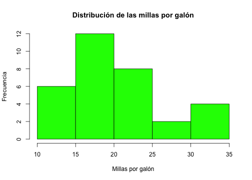
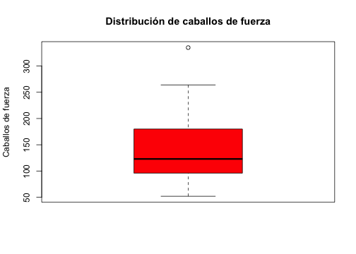
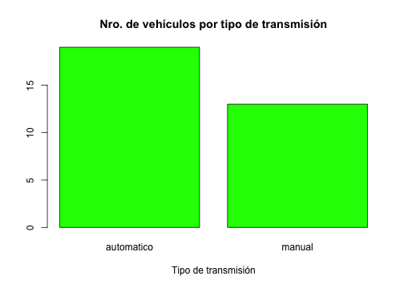
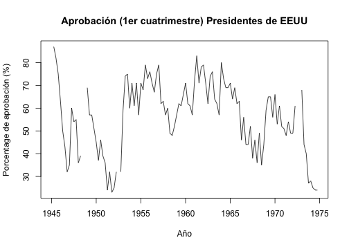

## ¿Qué es R?

* **R es un lenguaje y entorno open-soure para computación y gráficos estadísticos**

* R proporciona una amplia variedad de funcionalidades que permiten llevar adelante diferentes estudios estadísticos (modelado lineal y no lineal, pruebas estadísticas clásicas, análisis de series temporales, clasificación, agrupamiento) y visualizarlos a través de gráficos. 

* Es altamente extensible por lo que existen una importante cantidad de paquetes de software (4000) que extendienden su funcionalidad

[What is R?](https://www.r-project.org/about.html)

---

## Objetos

* Todo en R es un objeto

* El objeto más básico en R es el **vector**, que es un contenedor de objectos que puede alojar objetos del mismo tipo

* La única **excepción** son las **listas** (o list en inglés), que son vectores que pueden contener diferentes tipos de objetos

---

## Tipos de objetos

R maneja cinco tipos básicos (o atómicos) de objetos:

- caracteres (letras) o **character** en inglés

- numérico (números reales de doble precisión) o **numeric** en inglés

- entero o **integer** en inglés

- complejo o **complex** en inglés

- lógico (True/False) o **logic** en inglés

---

## Creando vectores

La función `c()` puede ser usada para crear vectores de objetos


```r
  nu = c(0.5, 0.6)             ## vector de 2 objetos del tipo númerico
  l1 = c(TRUE, FALSE, TRUE)    ## vector 3 objetos del tipo lógico
  l2 = c(T, F)                 ## vector de 3 objetos del tipo lógico
  ch = c('a')                  ## vector de 1 objeto del tipo caracter
  it = 9:29                    ## vector de 21 objetos del tipo entero
  co = c(1+0i, 2+4i)           ## vector de 2 objetos del tipo complejo
```

El caracter `#` indica que lo que está a la derecha es un comentario y por tanto es ignorado

El operador `:` es usado para crear secuencia de enteros

---

## Creando vectores

También se pueden crear vectores usando la función `vector()`


```r
  v = vector('numeric', length = 10) 
  v[1] = 5
  v  # auto-impresion
```

```
##  [1] 5 0 0 0 0 0 0 0 0 0
```

```r
  print(v) # impresion explícita
```

```
##  [1] 5 0 0 0 0 0 0 0 0 0
```

El `[1]` indica que el objeto es un vector y que `5` es su primer elemento

---

## Mezclando objetos

Que pasaría si mezclamos objetos de diferentes tipos en un mismo vector


```r
  y = c(1.7, 'a')   ## character
  y
```

```
## [1] "1.7" "a"
```

```r
  y = c(TRUE, 2)    ## numeric
  y
```

```
## [1] 1 2
```

---

## Mezclando objetos


```r
  y = c('a', TRUE)  ## character
  y
```

```
## [1] "a"    "TRUE"
```

Cuando mezclamos objetos de clases distintas, R intenta convertir los objetos a una misma clase siguiendo el siguiente esquema de precedencia y ocurriendo lo que se denomina *coeción implícita*:

1. logical (menor precedencia)
2. integer
3. numeric
4. complex
5. character (mayor precedencia)

---

## Coeción Explícita

Los objetos pueden ser explícitamente convertidos de una clase a otra utilizando (de ser posible) las funciones `as.*`


```r
x = 0:6
class(x)  # la función `class` se utiliza para averiguar la clase de un objeto
```

```
## [1] "integer"
```

```r
x = as.numeric(x)
x
```

```
## [1] 0 1 2 3 4 5 6
```

---

## Coerción Explícita


```r
x = as.logical(x)
x
```

```
## [1] FALSE  TRUE  TRUE  TRUE  TRUE  TRUE  TRUE
```

```r
x = as.character(x)
x
```

```
## [1] "FALSE" "TRUE"  "TRUE"  "TRUE"  "TRUE"  "TRUE"  "TRUE"
```

---

## Coerción Explícita

No todos los objetos de una clase se pueden convertir a otra, por ejemplo


```r
x = c("a", "b", "c")
as.numeric(x)
```

```
## Warning: NAs introduced by coercion
```

```
## [1] NA NA NA
```

```NA``` (**"not available"**) es utilizado por R para indicar que un valor no está disponible


```r
as.logical(x)
```

```
## [1] NA NA NA
```

---

## Matrices

Las matrices son un tipo especial de vectores donde los elementos se encuentran organizados en filas y columnas.


```r
m = matrix(1:6, nrow = 2, ncol = 3) # creando una matriz de 2 filas y 3 columnas
m
```

```
##      [,1] [,2] [,3]
## [1,]    1    3    5
## [2,]    2    4    6
```

En R las matrices son objetos que cuentan con el atributo **dimensión**.


```r
dim(m)  # opteniendo la dimensión de la matriz
```

```
## [1] 2 3
```

---

## Matrices

Las matrices son construidas por columna. El primer elemento se encuentra en la esquina superior izquierda y a partir de ahí los siguientes van creandose a lo largo de las columnas


```r
m = matrix(1:6, nrow = 2, ncol = 3)
m
```

```
##      [,1] [,2] [,3]
## [1,]    1    3    5
## [2,]    2    4    6
```

Para acceder a los elementos de la matriz se debe indicar entre ```[]``` la fila y columna separado por ```,```


```r
m[2, 1] # elemento de la segunda fila primera columna 
```

```
## [1] 2
```

---

## Atributos

La función ```attributes``` sirve para conocer los atributos de un objeto en R.


```r
attributes(m)
```

```
## $dim
## [1] 2 3
```

---

## cbind-ing y rbind-ing

Las matrices también pueden ser creadas acoplando vectores por columna o fila con las funciones `cbind()` and `rbind()`, respectivamente


```r
x = 1:3  # creando vector con la sequencia de enteros 1, 2, 3
y = 10:12  # creando vector con la sequencia de enteros 10, 11, 12
z = cbind(x, y)  # acoplando los vectores por columna para crear una matriz
z
```

```
##      x  y
## [1,] 1 10
## [2,] 2 11
## [3,] 3 12
```

```r
w = rbind(x, y) # acoplando los vectores por fila para crear una matriz
```

---

## Listas

Las listas son un tipo especial de vectores que pueden contener elementos de diferentes clases


```r
x = list(1, "a", TRUE, 1 + 4i) 
x
```

```
## [[1]]
## [1] 1
## 
## [[2]]
## [1] "a"
## 
## [[3]]
## [1] TRUE
## 
## [[4]]
## [1] 1+4i
```

---

## Factores

Los factores son usados en R para representar **datos categóricos**


```r
x = factor(c('yes', 'yes', 'no', 'yes', 'no')) 
x
```

```
## [1] yes yes no  yes no 
## Levels: no yes
```

La función ```table``` muestra la frecuencia de cada categoría.


```r
table(x)
```

```
## x
##  no yes 
##   2   3
```

---

## Factores ordenados

En R los **datos ordinales** se represetan a través de factores ordenados. El orden de los factores se establece utilizando el argumento `levels` de la función `factor()`


```r
x = factor(c('yes', 'yes', 'no', 'yes', 'no'), levels=c('yes', 'no'))
x
```

```
## [1] yes yes no  yes no 
## Levels: yes no
```

---

## Valores desconocidos

En R los valores desconocidos se representan con los símbolos `NA` (o `NaN` para operaciones matemáticas indefinidas)

- `is.na()` es usado para chequear si un objeto es `NA`

- `is.nan()` es usado para comprobar la presencia de `NaN`

- Un valor `NaN` es al mismo tiempo `NA` pero lo opuesto no se da


```r
x = c(1, 2, NA, 10, 3)
is.na(x)
```

```
## [1] FALSE FALSE  TRUE FALSE FALSE
```

---

## Data Frames

En R los data frames son usados para alojar datos en forma tabular

- Son un tipo especial de matriz que puede contener elementos de diferentes clases (las matrices pueden tener solo elementos del mismo tipo)

- Usualmente son creados mediante las funciones `data.frame`, `read.table()`, o `read.csv()`

- Pueden ser convertido a una matriz por medio de la función `data.matrix()`


```r
x = data.frame(c1 = 1:5, c2 = c(T, T, F, F, T), c3 = c('a', 'b', 'c', 'd', 'e')) 
x
```

```
##   c1    c2 c3
## 1  1  TRUE  a
## 2  2  TRUE  b
## 3  3 FALSE  c
## 4  4 FALSE  d
## 5  5  TRUE  e
```

---

## Data Frames

Número de filas del data frame


```r
nrow(x)
```

```
## [1] 5
```

Número de columnas del data frame


```r
ncol(x)  
```

```
## [1] 3
```

---

## Names

Nombre de las columnas del data frame


```r
x
```

```
##   c1    c2 c3
## 1  1  TRUE  a
## 2  2  TRUE  b
## 3  3 FALSE  c
## 4  4 FALSE  d
## 5  5  TRUE  e
```

```r
names(x)
```

```
## [1] "c1" "c2" "c3"
```

---

## Names

Las listas pueden también tener nombre


```r
x = list(a = 1, b = 2, c = 3)
names(x)
```

```
## [1] "a" "b" "c"
```

---

## Estructura de control: if

```r
if(<condicion>) {
        ## hacer algo
} else {
        ## hacer otra cosa
}
if(<condicion1>) {
        ## hacer algo
} else if(<condicion2>)  {
        ## hacer algo diferente
} else {
        ## hacer otra cosa
}
```

---

## Estructura de control: if

Ejemplo


```r
x = 2
y = 0
if (x > 3) {
  y = 10
} else {
  y = 50
}
y
```

```
## [1] 50
```

---

## Estructura de control: if

La clausula ```else``` no es siempre necesaria  

```r
if (<condicion>) {
  # hacer algo
}
```


```r
x = 10
if (x==10) {  # !=
  print('El valor de x es el esperado')
}
```

```
## [1] "El valor de x es el esperado"
```

---

## Ciclos: for

Los ciclos `for` toman una variable *interator* y le asignan valores sucesivos de una secuencia o vector. Los ciclos ```for``` son los más utilizados para iterar sobre los elementos de un objeto


```r
x = data.frame(c1 = 4:6, c2 = 18:20)
for(i in seq_len(nrow(x))) {
  print(x[i, 'c1'])  # por cada fila imprimo el valor de la primera columna (nombre)
  print(x[i, 2])     # por cada fila imprimo el valor de la segunda columna (número)
}
```

```
## [1] 4
## [1] 18
## [1] 5
## [1] 19
## [1] 6
## [1] 20
```

Este ciclo toma la variable `i` y en cada iteración le asigna un nro de fila (1, 2, 3) y luego termina.

---

## Iteraciones: apply

La función ```apply``` nos permite ejecutar operaciones repetitivas sobre matrices y data frames


```r
x = data.frame(c1 = 1:3, c2 = 10:12); x
```

```
##   c1 c2
## 1  1 10
## 2  2 11
## 3  3 12
```

```r
apply(x, 2, median)  # apply(<objeto>, <fila (1) o columna (2)>, <funcion>)
```

```
## c1 c2 
##  2 11
```

Otras funciones que se puede utilizar: max, min, mean, sum

---

## Iteraciones: apply


```r
x = data.frame(c1 = 1:2, c2 = 10:11)
x
```

```
##   c1 c2
## 1  1 10
## 2  2 11
```

```r
mult = function(x, c) {
  return (x*c)
}
apply(x, 2, mult, 5)  # apply(<objeto>, <fila (1) o columna (2)>, <funcion>, <parametro>)
```

```
##      c1 c2
## [1,]  5 50
## [2,] 10 55
```

---

## Iteraciones: sapply

Similar a su par `apply` pero para listas y vectores. Retorna una lista


```r
x = data.frame(c1 = 1:2, c2 = 10:11)
x
```

```
##   c1 c2
## 1  1 10
## 2  2 11
```

```r
area_circulo = function(r) {
  return (3.14*r^2)
}
sapply(x[,'c1'], area_circulo)  # sapply(<lista o vector>, <funcion>, <otros parametros>)
```

```
## [1]  3.14 12.56
```

---

## Funciones especiales para operaciones comúnes

rowSums, rowMeans, colSums, colMeans


```r
x = data.frame(c1 = 1:5, c2 = 10:14)
x
```

```
##   c1 c2
## 1  1 10
## 2  2 11
## 3  3 12
## 4  4 13
## 5  5 14
```

```r
rowSums(x)
```

```
## [1] 11 13 15 17 19
```

---

## Lectura de datos

```read.csv``` es la función más utilizadas para la lectura de datos en formato csv. Algunos de sus parámetros son:

- `file`, nombre del archivo, incluyendo la ruta al mismo
- `header`, parámetro lógico indicando si el archivo cuenta con un encabezado
- `skip`, número de filas a ignorar desde el inicio del archivo
- `colClasses`, un vector de caracteres indicando la clase de cada columna en el dataset
- `nrows`, el número de filas del dataset a leer
- `comment.char`, cadena de caracteres indicando el caracter usado para comentarios
- `stringsAsFactors`, parámetro lógico indicando si las variables de tipo caracter deben ser codificadas como factores


```r
data = read.csv(file = 'becal-cobertura.csv', header = T, stringsAsFactors = F)
```

---

## Escritura de datos

```write.csv``` es la función más utilizadas para la escritura de datos en formato csv. Algunos de sus parámetros son:

- x, dataset a guardar en archivo 
- `file`, nombre del archivo, incluyendo la ruta al mismo
- `row.names`, ignorar o no nombre de filas


```r
write.csv(x, 'leccion4.csv', row.names=F)
```

---

## Estructura de datos

La función ```str``` se utiliza para una exploración rápida de la estructura del dataset


```r
str(data, vec.len=1)
```

```
## 'data.frame':	907 obs. of  9 variables:
##  $ No                                    : int  1 2 ...
##  $ C.I.                                  : chr  "2.485.187" ...
##  $ Nombre.y.Apellido                     : chr  "Alejandra Recalde Carballo" ...
##  $ Tipo.de.Beca..según.Programa.aprobado.: chr  "Doctorado para Investigadores en CyT" ...
##  $ Maestria...Doctorado                  : chr  "Doctorado en Biotecnología Molecular" ...
##  $ Universidad.de.Destino                : chr  "Universidad de Chile" ...
##  $ Pais                                  : chr  "Chile" ...
##  $ Dept..de.Origen                       : chr  "Capital" ...
##  $ Total.General                         : chr  "$             82.896" ...
```

---

## Visualización

Funciones de visualización más comunes:

1 variable:
* Histogramas
* Boxplots
* Barra
* Linea

2 variables:
* Scatterplots


---

## Histograma


```r
hist(autos$mpg, col='green', main='Distribución de las millas por galón', 
     xlab='Millas por galón', ylab='Frecuencia')
```



---

## Boxplots


```r
boxplot(autos$hp, col='red', main='Distribución de caballos de fuerza', 
        ylab='Caballos de fuerza')
```



---

## Barra


```r
barplot(table(autos$am), col='green', xlab='Tipo de transmisión',
        main='Nro. de vehículos por tipo de transmisión')
```



---

## Linea


```r
plot(presidents, ylab = 'Porcentage de aprobación (%)', xlab='Año',
     main = 'Aprobación (1er cuatrimestre) Presidentes de EEUU')
```



---

## Scatterplots


```r
plot(autos$mpg, autos$wt, col='blue', xlab='Millas por galón', ylab='Peso (libras)',
     main='Relación entre peso del vehículo y millas recorridas por galón')
```


