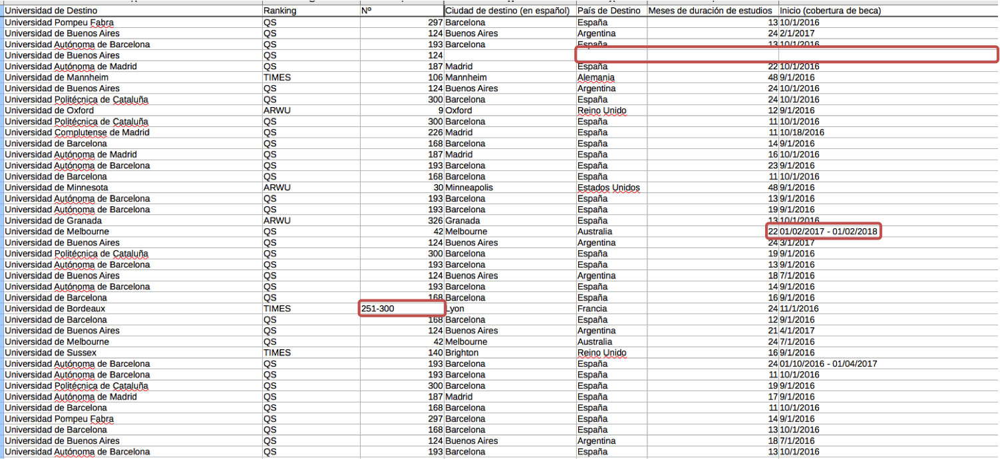

--- &twocol

## Preparación de datos 

* La preparación de los datos es un proceso iterativo donde primero se identifican los errores y luego se corrigen

*** {name: left}

**Ejemplos de errores**:

  - Diferentes formatos: 
    + 24/08/17 o 08/24/17, 2 o `dos`
  - Diferentes unidades de medida: 
    + 3500$ o 3500€
  - Valores incorrectos: Precio: 4,800Gs.
  - Valores ausentes: Edad: `NULL`
  - Valores desconocidos: 
    + Nombre: JorgeⒶ웃|"""✪✪

*** {name: right}

**Fuente de errores**:

  - Errores introducidos por personas
  - Mala aplicación de estándares de codificación
  - Integración datos con diferentes esquemas, ej., altura: 6.2'' o 1.88m
  - Legacy systems
  - Migración de datos
  - Errores de programación
  - Errores en la transmición de los datos

---

## Ejemplo de datos problemáticos (BECAL)



---

## Datos de buena calidad

Existen medidas estándar para determinar la calidad de los datos

- **Validez**: se ajustan a un esquema definido 
  + E.j., esquema de nro. de teléfono +(prefijo)nnn-nnnn

- **Precisión**: se ajustan a estándares conocidos
  + E.j., código de país (ISO-3166 AU, BB, IT, PY)

- **Completitud**: el dataset contiene todos los registros que deberia tener

- **Consistencia**: campos dependientes en el dataset deben ser consistentes 
  + E.j., fecha de fin debe ser posterior a fecha de inicio

- **Uniformidad**: mismas unidades de medida 
  + E.j., distancia en millas o kilometros?

---

## Acciones correctivas y de preparación de datos

Normalmente se realizan algunas de las siguientes acciones para corregir errores y preparar los datos

- Eliminar o corregir errores de tipeo
- Validar contra estándares conocidos
- Control cruzado de datos
- Completar los datos a disponición incorporando información de otras fuentes
- Normalizar datos (e.j., transformar Ave. a Avenida o Tte. a Teniente)

---

## Herramientas de preparación de datos en R

- partición y ordenamiento

- manejo de texto

  - tolower/toupper
  - strsplit
  - gsub
  - grep/grepl
  - str_trim
  - nchar
  - paste
  - substr
  
- merge

- dplyr

  - select
  - filter
  - arrange
  - rename
  - mutate

---

## Partición


```r
x = data.frame('var1'=sample(1:3),'var2'=sample(6:8),'var3'=sample(11:13))
x
```

```
##   var1 var2 var3
## 1    1    8   13
## 2    2    6   12
## 3    3    7   11
```
Todos los registros de la columna indicada por su respectivo indice

```r
x[,1]
```

```
## [1] 1 2 3
```

---

## Partición

Todos los registros de la columna indicada por su nombre

```r
x[,'var1']
```

```
## [1] 1 2 3
```
Los registros indicados por sus respectivos indices

```r
x[1:2,'var2']
```

```
## [1] 8 6
```

---

## Partición con expresiones lógicas


```r
x[(x$var1 <= 3 & x$var3 > 11),]   # AND
```

```
##   var1 var2 var3
## 1    1    8   13
## 2    2    6   12
```

```r
x[(x$var1 <= 3 | x$var3 > 15),]   # OR
```

```
##   var1 var2 var3
## 1    1    8   13
## 2    2    6   12
## 3    3    7   11
```

---

## Ordenamiento


```
##   var1 var2 var3
## 1    1    8   13
## 2    2    6   12
## 3    3    7   11
```


```r
sort(x$var1)  # ordenamiento ascendente por defecto
```

```
## [1] 1 2 3
```

```r
sort(x$var1,decreasing=TRUE)
```

```
## [1] 3 2 1
```

---

## Texto a minúscula/mayúscula


```r
becal[1:5,'Sexo']
```

```
## [1] "Femenino"  "Masculino" "Masculino" "Femenino"  "Femenino"
```


```r
tolower(becal[,'Sexo'])[1:5]   # convertir todas las letras de la palabra a minúsculas
```

```
## [1] "femenino"  "masculino" "masculino" "femenino"  "femenino"
```

```r
toupper(becal[,'Sexo'])[1:5]   # convertir todas las letras de la palabra a mayúsculas
```

```
## [1] "FEMENINO"  "MASCULINO" "MASCULINO" "FEMENINO"  "FEMENINO"
```

---

## strsplit: divir texto


```r
becal[1:2,'Fecha.firma.de.Contrato']
```

```
## [1] "9/15/2015" "9/9/2015"
```

```r
strsplit(becal[1:2,'Fecha.firma.de.Contrato'], '/')  # divir el texto de fecha utilizando la barra como separador 
```

```
## [[1]]
## [1] "9"    "15"   "2015"
## 
## [[2]]
## [1] "9"    "9"    "2015"
```


```
## [1] "9"    "15"   "2015"
```

---

## gsub: remplazar caracter en texto


```r
becal[1:2,'C.I.']
```

```
## [1] " 2,485,187 " " 2,271,427 "
```

```r
gsub(',', '', becal[,'C.I.'])[1:2]   # eliminar (o remplazar por vacio) las comas del texto cédula
```

```
## [1] " 2485187 " " 2271427 "
```

---

## grep/grepl: búscar caracteres en texto


```r
becal_c[c(1,210,843),'Total.General']
```

```
## [1] "$             82.896"  "$             3 0.668" "€ 23.570,05"
```

```r
grep('€',becal_c[c(1,210,843),'Total.General'])  # buscar la presencia del caracter euro
```

```
## [1] 3
```


```r
grepl('€',becal_c[c(1,210,843),'Total.General'])  # buscar la presencia del caracter euro
```

```
## [1] FALSE FALSE  TRUE
```

---

## str_trim: eliminación de espacios vacíos redundantes


```r
library(stringr)
```


```r
becal[1:2,'Condición']
```

```
## [1] "Becario " "Becario "
```

```r
str_trim(becal[1:2,'Condición'])  # eliminar espacios vacío al inicio y final del texto
```

```
## [1] "Becario" "Becario"
```

---

## Otras funciones de manejo de texto


```r
becal_c[1,'Universidad.de.Destino']
```

```
## [1] "Universidad de Chile"
```

```r
nchar(becal_c[1,'Universidad.de.Destino'])  # contar el número de caracteres del texto
```

```
## [1] 20
```

```r
substr(becal_c[1,'Universidad.de.Destino'],16,20)  # extraer parte del texto
```

```
## [1] "Chile"
```

---

## Otras funciones de manejo de texto


```r
becal_c[1,c(5,6)]
```

```
##                   Maestria...Doctorado Universidad.de.Destino
## 1 Doctorado en Biotecnología Molecular   Universidad de Chile
```

```r
paste0(becal_c[1,5],' (',becal_c[1,6],')')
```

```
## [1] "Doctorado en Biotecnología Molecular (Universidad de Chile)"
```

---

## Unir datasets con merge


```
## [1] "Tamaño del dataset becal2017.csv (becal): 914 filas x 36 columnas"
```


```
## [1] "Tamaño del dataset becal-cobertura.csv (becal_c): 907 filas x 9 columnas"
```

Unir ambos datasets de becal utilizando el número de cédula como clave común entre ambos. El parámetro ```all.y``` indica que se descartarán los registros que existan en x pero no en y


```r
ambos_becal = merge(becal, becal_c, by.x="C.I.", by.y="C.I.", all.y=TRUE)
```


```
## [1] "Tamaño del dataset final: 907 filas x 44 columnas"
```

---

## Manipulación de data frames con dplyr


Dplyr es un paquete de funcionalidades de R que permite manipular frames de datos de forma conveniente. Sus principales funciones son:

* `select`: obtener un subconjunto de las columnas seleccionadas del data frame

* `filter`: extraer un subconjunto de filas del data frame seleccionadas a partir de condiciones lógicas

* `arrange`: reordena las filas de un data frame

* `rename`: renombra las variables de un data frame

* `mutate`: agregar nuevas variables (columnas) al data frame

---

## Dplyr: select


```r
head(select(becal, C.I., Sexo, Edad))  # head sirve para mostrar las primeras n filas del dataframe
```

```
##        C.I.      Sexo Edad
## 1  2485187   Femenino   26
## 2  2271427  Masculino   28
## 3  1937293  Masculino   32
## 4  3964773   Femenino   24
## 5  3209470   Femenino   29
## 6  2330407   Femenino   30
```

---

## Dplyr: filter


```r
dataset_filtrado = filter(becal, Sexo=='Femenino')
```


```
##        C.I.     Sexo Edad
## 1  2485187  Femenino   26
## 2  3964773  Femenino   24
## 3  3209470  Femenino   29
## 4  2330407  Femenino   30
## 5  2241073  Femenino   28
## 6  2178736  Femenino   29
```

---

## Dplyr: arrange


```r
dataset_ordenado = arrange(becal, Edad)
```


```
##        C.I.      Sexo Edad
## 1  3761383  Masculino   22
## 2  2182256   Femenino   22
## 3  3513438   Femenino   23
```


```r
dataset_ordenado_desc = arrange(becal, desc(Edad))
```


```
##       C.I.     Sexo Edad
## 1  667357  Femenino   58
## 2  563373  Femenino   58
## 3  610370  Femenino   57
```

---

## Dplyr: rename


```r
becal_renombrado = rename(becal, ci = C.I., sexo = Sexo, edad = Edad)
```


```
##          ci      sexo edad
## 1  2485187   Femenino   26
## 2  2271427  Masculino   28
## 3  1937293  Masculino   32
## 4  3964773   Femenino   24
## 5  3209470   Femenino   29
## 6  2330407   Femenino   30
```

---

## Dplyr: mutate


```r
becal_gs = mutate(becal_c, total_gs=5500*convertir_totalgeneral(Total.General))
head(select(becal_gs, Total.General, total_gs), 5)
```

```
##          Total.General  total_gs
## 1 $             82.896 455928000
## 2 $             29.000 159500000
## 3 $             79.376 436568000
## 4 $             19.118 105149000
## 5 $             56.089 308489500
```
